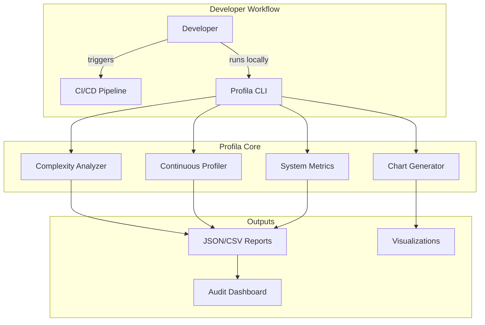
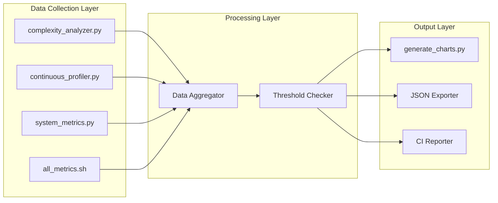

# Profila Architecture Overview

## System Context

## Component Architecture

## Technology Stack

| Component | Technology | Purpose |
|-----------|------------|---------|
| Language | Python 3.11 | Core profiling logic |
| AST Parsing | stdlib `ast` | Code complexity analysis |
| System Metrics | `psutil` | Cross-platform metrics |
| Visualization | `matplotlib` | Chart generation |
| CLI | `argparse` | Command-line interface |
| CI Integration | GitHub Actions | Automated execution |
| Testing | `pytest` | Unit/integration tests |

## Security Considerations

- No network connections required (offline capable)
- No code execution during analysis (AST only)
- Temporary files cleaned up after execution
- No sensitive data in generated reports
